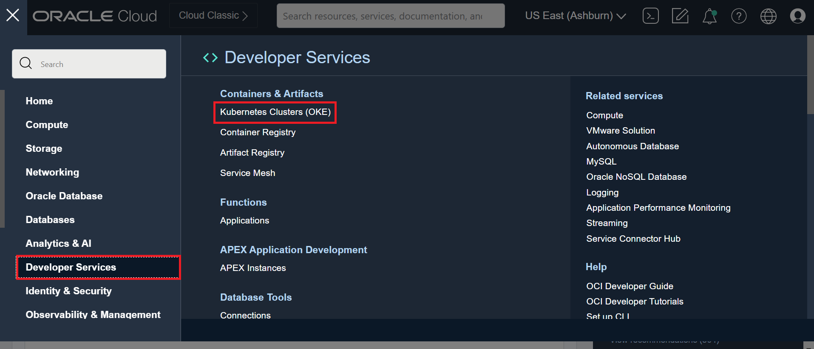
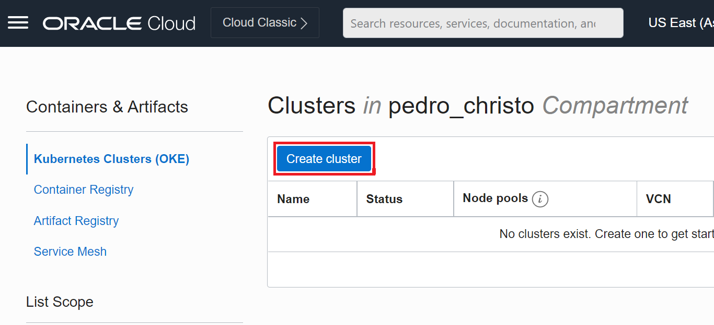
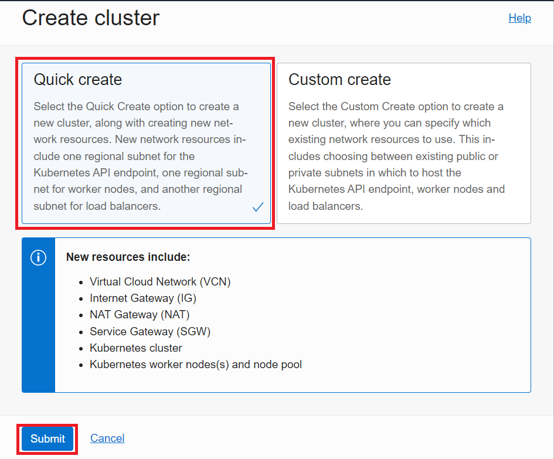
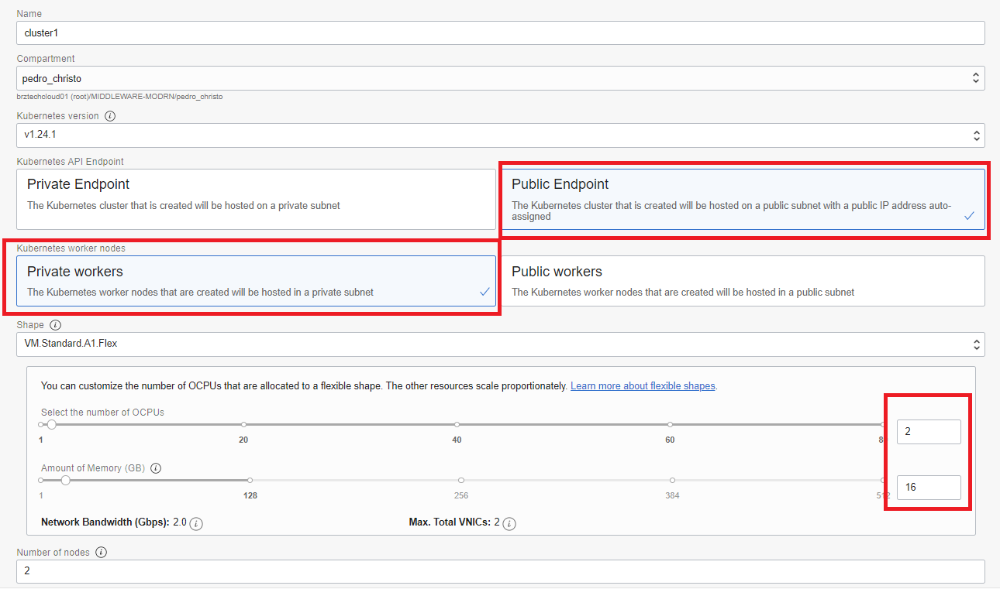
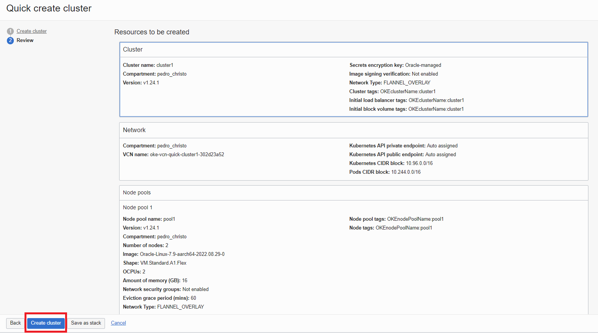
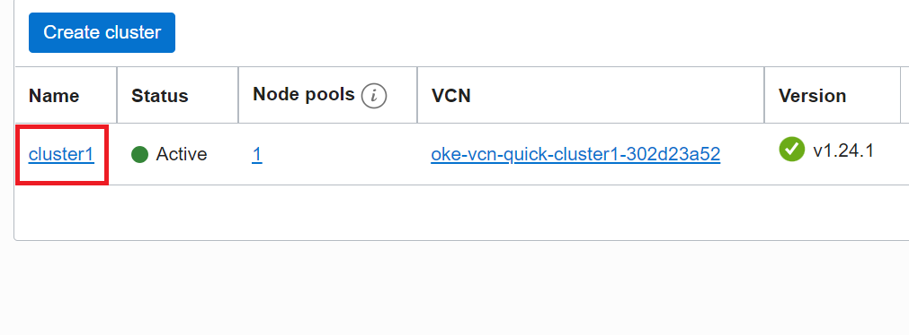
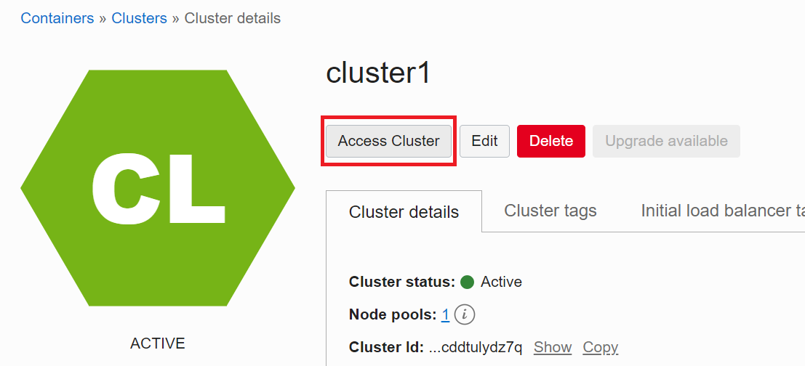
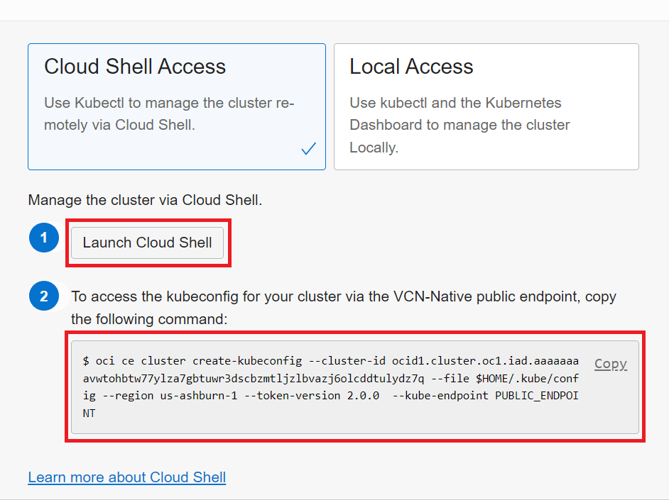

# Lab Kubernetes

Objetivo do lab é cria um cluster de Kubernetes no OCI com node pool ARM e subir um servidor web rodando uma página web estática.

## Lab

1. [Criação do Cluster](#Criacao-Do-Cluster)

## Criação do Cluster

Nave gue no menu da Oracle Cloud e vá em Developer Services -> Kubernetes Cluster (OKE).



Clique em **Create Cluster**, aparecerá um popup onde será selecion a opção **Quick Create** e clique em **Create**.





Na tela de configuração vamos preencher os campos da seguinte maneira:

- **Kubernetes Version**: v1.24.1
- **Kubernetes API Endpoint**: Public Endpoint
- **Kubernetes worker nodes**: Private workers
- **Shape**: VM.Standard.A1.Flex
- **Select the number of OCPUs**: 2
- **Amount of Memory (GB)**: 16
- **Number of nodes**: 2



Após preencher os campos basta clicar em Next e verá uma tela como a da imagem abaixo. Onde basta clicar em **Create Cluster**.



Espere alguns minutos para a conclusão da criação completa do cluster.

2. Acessando o Cluster no Cloud Shell

Navegue novamente pelo menu do OCI Developer Services -> kubernetes Cluster (OKE). Clique no cluster criado no passo anterior.



Na página de detalhes do cluster clique em **Access Cluster**, um popup irá aparecer na tela. Copie o código que aparece no passo 2 do popup e depois clique no botão **Launch Cloud Shell**.





Com o Cloud Shell aberto, cole e execute o código copiado no passo anterior. Após a execução do código valide se o acesso foi criado corretamente executando o código abaixo.

``` 
$ kubectl get nodes
```
Resposta
``` 
NAME          STATUS   ROLES   AGE    VERSION
10.0.10.202   Ready    node    126m   v1.24.1
10.0.10.232   Ready    node    142m   v1.24.1
```


